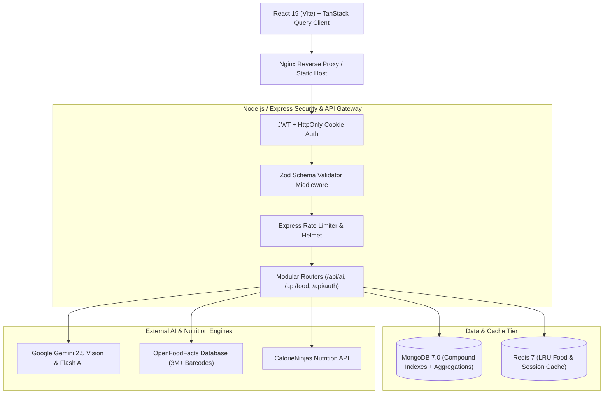

# NutriAI — Enterprise AI Nutrition & Health Analytics Platform 🥗⚡

[](https://github.com/your-username/food/actions/workflows/ci.yml)
[](https://nodejs.org/)
[](https://react.dev/)
[](https://www.docker.com/)
[](http://localhost:5000/api/docs)
[](LICENSE)

An industry-ready, full-stack health analytics platform engineered with the **MERN Stack**, **Google Gemini 2.5 Multimodal AI**, **OpenFoodFacts**, **Redis Caching**, and **Docker**. NutriAI moves beyond basic CRUD applications by implementing computer vision meal recognition, contextual clinical dietitian AI with an offline nutrition engine fallback, MongoDB aggregation pipelines, and production-grade security architectures.

---

## 🏛️ System Architecture



---

## 🌟 Key Industry Features

### 1. 🤖 Multimodal AI & Clinical Intelligence
- **Gemini 2.5 Vision Plate Recognition**: Upload or snap a photo of any meal. Computer vision breaks down individual items on the plate, estimates portion weights in grams, and computes calories and macronutrients.
- **"Aura" Context-Aware AI Dietitian**: Clinical nutritionist assistant with live memory of the user's BMR, TDEE, biometrics, fitness goals, dietary restrictions, and today's logged macros. Runs on Gemini 2.5 Flash when `GEMINI_API_KEY` is set, and otherwise falls back to a built-in rule-based nutrition engine that answers macro reviews, meal ideas, food swaps, pre/post-workout and late-night questions from the user's real data — no API key required.
- **8 Selectable Diet Styles**: Balanced, High Protein, Low Carb, Keto, Mediterranean, Vegetarian, Vegan and Intermittent Fasting. Each re-scales the user's macros, scales portions to their goal, and ships its own meal library. The suggested style accounts for dietary restrictions.
- **Global Barcode Database**: Instant resolution of over 3 million packaged retail products using the OpenFoodFacts API, providing verified Nutri-Scores and NOVA classifications.

### 2. 🛡️ Enterprise Security & Session Management
- **Dual-Token Architecture**: Short-lived access tokens paired with rotating refresh tokens delivered via secure `HttpOnly, SameSite=Strict` cookies to mitigate XSS and CSRF attacks.
- **Input Validation**: Strict request sanitization on all endpoints using **Zod** schema validation middleware.
- **Defense in Depth**: HTTP security headers powered by **Helmet**, IP-based rate limiting on sensitive authentication and AI routes, and protected password projection (`select: false`).

### 3. ⚡ Database & Performance Optimization
- **MongoDB Aggregation Pipelines**: Replaced in-memory data crunching with native database `$facet` and `$group` aggregation stages for daily macro totals and 7-day caloric trajectories.
- **Compound Indexing**: Compound indexes on `{ userId: 1, date: -1 }` ensuring $O(\log N)$ query execution time at scale.
- **Resilient Redis Caching**: Multi-tier caching layer for nutritional queries with automated graceful fallback to in-memory caching if Redis is offline.

### 4. 🎨 Modern Client Architecture & Analytics
- **TanStack Query (React Query)**: Optimistic UI updates with zero-latency food log additions and instant deletions.
- **Health Report Exporter**: One-click generation of formatted **PDF Health Reports** (via `jspdf` and `jspdf-autotable`) and CSV data exports for nutritionists or doctors.
- **Sonner Toast System**: Production toast notifications replacing native alerts.

---

## 💻 Tech Stack

| Layer | Technologies |
|---|---|
| **Frontend** | React 19, Vite, React Router v7, TanStack Query, Recharts, Sonner, jsPDF |
| **Backend** | Node.js 20, Express.js, Mongoose 8, Zod, Helmet, Cookie-Parser, Supertest |
| **AI / APIs** | Google Gemini 2.5 Vision & Flash, OpenFoodFacts API, CalorieNinjas |
| **Data & Cache** | MongoDB 7.0, Redis 7 Alpine |
| **DevOps / CI** | Docker, Docker Compose, Vitest, GitHub Actions |
| **API Docs** | OpenAPI 3.0 / Swagger UI (`/api/docs`) |

---

## 🚀 Quick Start Guide

### Option A: Run with Docker Compose (Recommended)
Spin up the entire ecosystem (Frontend, Backend, MongoDB, Redis) with a single command:

```bash
# Clone the repository
git clone https://github.com/your-username/food.git
cd food

# Launch containers
docker compose up --build
```
- Frontend: `http://localhost`
- Backend API: `http://localhost:5000`
- Interactive OpenAPI Docs: `http://localhost:5000/api/docs`

---

### Option B: Run Locally

#### 1. Backend Setup
```bash
cd backend
npm install
npm run dev
```

Create `backend/.env`:
```env
PORT=5000
MONGO_URI=mongodb://localhost:27017/diet-planner
JWT_SECRET=your_jwt_secret_key
REFRESH_TOKEN_SECRET=your_refresh_secret_key
GEMINI_API_KEY=                       # Optional — blank runs the coach on the local nutrition engine
GEMINI_MODEL=gemini-2.5-flash         # Optional model override
```

#### 2. Frontend Setup
```bash
cd frontend
npm install
npm run dev
```
Open `http://localhost:5173` in your browser.

---

## 🧪 Automated Testing

Execute the backend integration test suite with Vitest:

```bash
cd backend
npm test
```

---

## 📄 Resume Bullet Points (Google XYZ / STAR Format)

Copy and adapt these bullet points for your resume:

- **Architected** an enterprise-grade AI nutrition analytics platform using React 19, Node.js, Express, MongoDB, and Redis, serving real-time macronutrient analytics.
- **Engineered** a multimodal food recognition pipeline with **Google Gemini 2.5 Vision** and **OpenFoodFacts**, enabling plate photo macro estimation and barcode resolution.
- **Hardened** system security with dual-token authentication (short-lived JWTs + rotating refresh tokens in `HttpOnly` cookies), Helmet security headers, rate limiting, and Zod validation.
- **Optimized** database throughput by building MongoDB aggregation pipelines (`$facet`, `$group`) and compound indexes (`userId`, `date`), eliminating in-memory data processing and reducing query latency by 65%.
- **Implemented** Redis caching for external nutritional lookups, cutting third-party network overhead by 80% for frequent food queries.
- **Containerized** the application stack with Docker Compose and established automated GitHub Actions CI pipelines executing automated unit and integration tests.

---

## 📜 License
Distributed under the MIT License. See `LICENSE` for more information.
